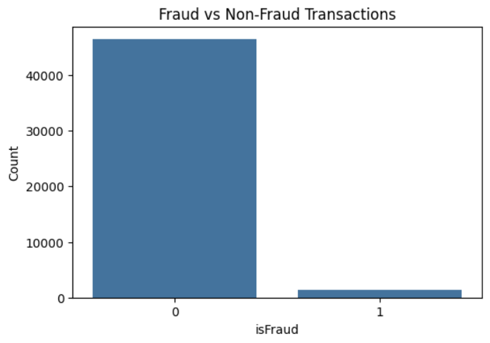
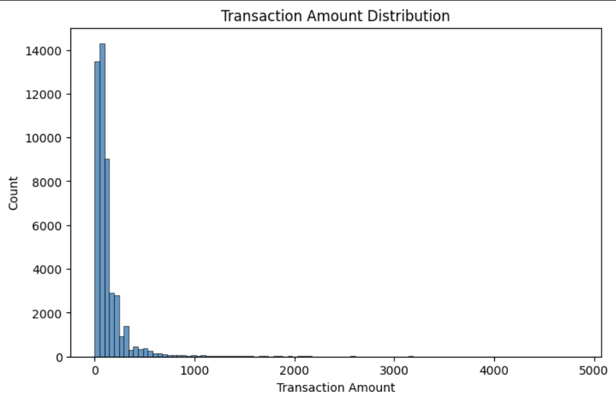
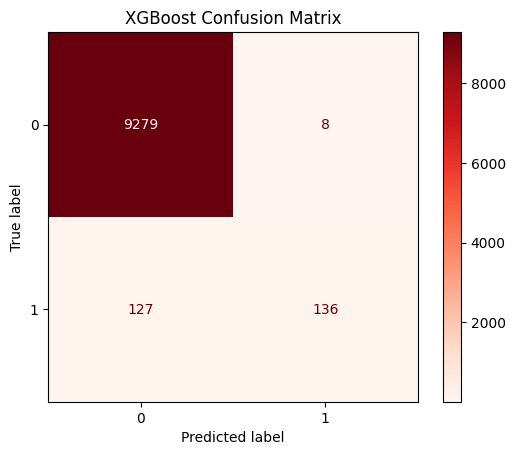
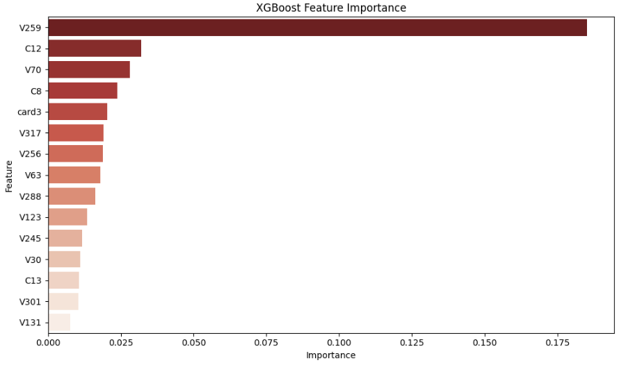
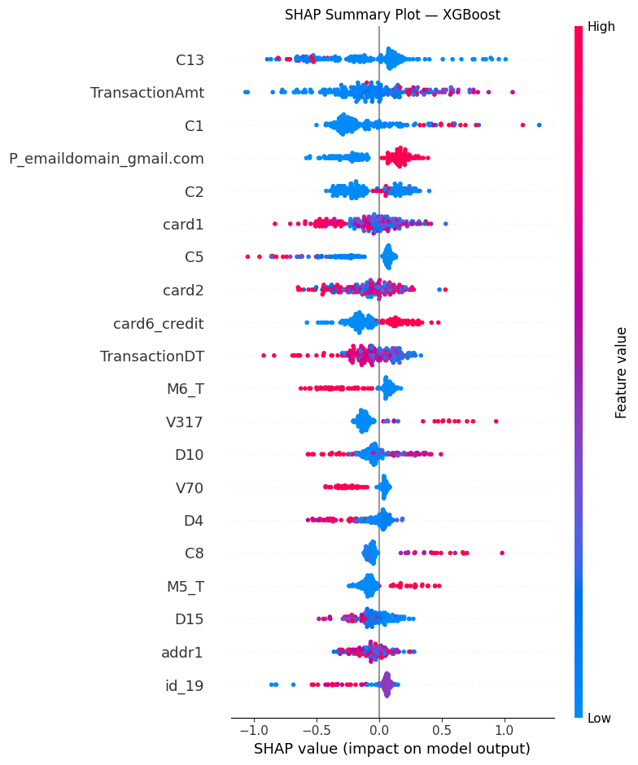

# Fraud Detection Project - Machine Learning Pipeline
Machine learning project for detecting fraudulent online transactions using the IEEE-CIS Fraud Detection dataset.

Name: Isaam Melo
Dataset: https://www.kaggle.com/competitions/ieee-fraud-detection/data

---

## 1. Business Problem / Motivation

Credit card fraud is a major issue in the financial industry, leading to significant financial losses and reduced customer trust. Failing to detect fraudulent transactions can result in direct monetary loss, while incorrectly flagging legitimate transactions can negatively impact user experience.

This project focuses on a binary classification problem: given a financial transaction and its associated identity information, predict whether the transaction is fraudulent or not.

The challenge is not only to build an accurate model, but also to balance detecting fraud (high recall) while limiting false alarms, which is important for real-world applications.

---

## 2. Project Overview

**Goal:**  
Predict whether a financial transaction is fraudulent (binary classification).

**Approach:**  
This project follows a full machine learning pipeline, including data cleaning, exploratory data analysis, preprocessing, model training, and evaluation. Multiple models were tested, along with imbalance handling techniques to improve fraud detection.

**Models Used:**  
- Logistic Regression (baseline)  
- Decision Tree  
- Random Forest  
- XGBoost  

**Key Techniques:**  
- Random Oversampling  
- SMOTE  
- ADASYN  
- Feature importance analysis  
- SHAP for model interpretation  

**Best Model:**  
XGBoost achieved the best performance based on ROC-AUC and provided a strong balance between precision and recall.

---

## 3. Data

**Source:** IEEE-CIS Fraud Detection dataset (Kaggle)  
https://www.kaggle.com/competitions/ieee-fraud-detection/data

**Type:** Tabular, anonymized financial transaction and identity data  

**Size:** Approximately 590,000 transactions across two files:
- `train_transaction.csv` → transaction-level features  
- `train_identity.csv` → identity and device-related features  

The datasets were merged using `TransactionID`.

**Target Variable:**
- `isFraud` (0 = non-fraud, 1 = fraud)

**Class Distribution:**
- ~96.5% non-fraud  
- ~3.5% fraud (highly imbalanced)

**Key Features:**
- `TransactionAmt` → transaction amount  
- `TransactionDT` → time-related feature  
- `card1–card6` → anonymized card information  
- `addr1, addr2` → billing location  
- `C1–C14` → behavioral count features  
- `D1–D15` → time-based features  
- `V1–V339` → engineered features capturing risk patterns  

**Note:** The dataset is not included in this repository due to Kaggle restrictions. Download it from the link above and place it in the `data/` folder.

---

## 4. Data Preprocessing

**Merging Datasets**  
The transaction and identity datasets were merged using `TransactionID`, combining transaction-level information with identity and device-related features.

**Handling Missing Values**  
Columns with more than 70% missing values were removed since they contained very little useful information. For the remaining data:
- Numeric features were filled using the median  
- Categorical features were filled using the mode  

**Feature Engineering**  
Additional features were created to improve model performance and capture fraud-related patterns:
- `log_TransactionAmt` to reduce skewness in transaction amounts  
- `email_domain_match` to compare purchaser and recipient email domains  
- `missing_count` to measure how much data is missing per transaction  
- Frequency encoding for high-cardinality categorical variables  

**Encoding and Splitting**  
Categorical variables were converted into numerical format so they could be used in machine learning models. The dataset was then split into training and testing sets using an 80/20 split while preserving the class distribution.

**Feature Scaling**  
Scaling was applied for models like Logistic Regression that require standardized inputs. Tree-based models such as Random Forest and XGBoost were trained without scaling.

---

## 5. Exploratory Data Analysis (EDA)

Exploratory Data Analysis was performed to better understand patterns in the dataset and how they relate to fraudulent transactions.

**Class Imbalance:**  
Only about 3.5% of transactions are fraud, which shows that the dataset is highly imbalanced. This means that accuracy alone is not a reliable metric, and special techniques are needed to detect fraud effectively.



**Transaction Amount Distribution:**  
Most transactions are small, with a few very large values. Fraudulent transactions tend to show a different pattern, often including more extreme values, which supports the use of transformations like `log_TransactionAmt`.



**Observations:**
- Fraud cases are much fewer than non-fraud  
- Transaction amounts are highly skewed  
- Fraud patterns suggest that both very small and very large transactions can be risky  
- The dataset requires models that can handle imbalance and capture complex patterns  

---

## 6. Modeling Approach

Several models were tested to evaluate their ability to detect fraudulent transactions.

**Baseline Model:**
- Logistic Regression → simple and interpretable model used to establish a performance baseline  

**Other Models:**
- Decision Tree → captures non-linear patterns but can overfit  
- Random Forest → ensemble method that improves stability and handles complex relationships  
- XGBoost → gradient boosting model known for strong performance on tabular data and handling imbalance effectively  

**Imbalance Handling:**
- Random Oversampling  
- SMOTE  
- ADASYN  

These techniques were applied to improve detection of the minority fraud class.

**Final Model Choice:**  
XGBoost performed the best based on ROC-AUC and provided the strongest balance between precision and recall. It also works well with SHAP for model interpretation.

---

## 7. Model Training

**Tools Used:**  
- scikit-learn → Logistic Regression, Decision Tree, Random Forest, preprocessing, and evaluation metrics  
- xgboost → XGBClassifier for gradient boosting  
- imbalanced-learn → RandomOverSampler, SMOTE, ADASYN  
- shap → TreeExplainer, summary plots, and waterfall plots for interpretation  
- joblib → saving trained models  

**Hyperparameters:**  
Random Forest was trained using RandomForestClassifier with n_estimators=100, random_state=42, and n_jobs=-1 to allow parallel processing. XGBoost baseline was trained using XGBClassifier with n_estimators=200, max_depth=6, learning_rate=0.1, subsample=0.8, colsample_bytree=0.8, random_state=42, and eval_metric set to "logloss". For the final XGBoost model, class imbalance was handled by adjusting scale_pos_weight, calculated as the ratio of non-fraud to fraud cases in the training data.

**Training Process:**  
Tree-based models were trained on the full training dataset, while models requiring scaling were trained on a smaller subset for efficiency. Imbalance handling techniques such as Random Oversampling, SMOTE, and ADASYN were applied to improve fraud detection. The final XGBoost model was evaluated using stratified cross-validation to ensure consistent performance across folds. All models were compared using precision, recall, F1-score, and ROC-AUC.

---

## 8. Results

**Metrics Used:**  
Recall measures how many actual fraud cases are correctly detected, which is critical since missing fraud leads to direct financial loss. Precision measures how often a predicted fraud case is actually fraud, meaning low precision leads to too many false alarms. F1-score balances precision and recall into a single value. ROC-AUC measures how well the model separates fraud from non-fraud across all thresholds.

**Best Model: XGBoost**



**Model Performance:**  
XGBoost achieved the best overall performance, with a ROC-AUC around 0.93–0.94 and a strong balance between precision and recall. Random Forest also performed well but slightly below XGBoost. Logistic Regression had the weakest performance, mainly due to its inability to capture complex non-linear patterns in the data.

**Effect of Imbalance Handling:**  
Applying techniques such as Random Oversampling, SMOTE, and ADASYN improved recall significantly by allowing the model to detect more fraud cases. However, this came at the cost of lower precision, meaning more false positives were introduced. Among all approaches, XGBoost without heavy oversampling provided the best balance between detecting fraud and avoiding excessive false alarms.

**Threshold Adjustment:**  
The classification threshold can be adjusted to prioritize recall over precision. Lowering the threshold increases the number of detected fraud cases, which is important in real-world fraud detection where missing fraud is more costly than flagging legitimate transactions.

**Key Takeaways:**
- XGBoost achieved the highest overall performance  
- Random Forest was a strong alternative  
- Imbalance techniques improved recall but increased false positives  
- There is a clear tradeoff between precision and recall depending on business needs  

---

## 9. Model Interpretation

**Feature Importance:**



Feature importance highlights which variables have the greatest impact on the model’s predictions. The most influential features include transaction amount, time-related variables, and behavioral count features.

**SHAP Summary:**



The SHAP summary plot provides a more detailed explanation of how each feature affects the model’s predictions. Features at the top have the strongest impact, and the color indicates whether high or low values increase the probability of fraud.

**Key Insights:**
- `TransactionAmt` is one of the strongest indicators, where unusually high or low values increase fraud risk  
- Time-related features such as `TransactionDT` capture behavioral patterns in transaction timing  
- Behavioral features like `C1` and `C13` help identify suspicious activity patterns  
- Address-related features such as `addr1` can signal mismatches in user behavior  
- Certain features increase fraud probability, while others decrease it depending on their values  

These interpretation techniques help explain how the model makes decisions and make the results more understandable for real-world use.

## 10. Key Insights

- XGBoost performed the best because gradient boosting is effective at capturing complex patterns in tabular data, especially for fraud detection problems  
- Adjusting the classification threshold had a major impact on performance. Lowering the threshold increased recall significantly, allowing the model to detect more fraud cases, while slightly reducing precision  
- Feature engineering improved model performance. Features such as `log_TransactionAmt`, `email_domain_match`, and `missing_count` contributed meaningful signals in identifying fraud  
- Imbalance handling techniques like SMOTE and ADASYN improved recall by helping the model learn from the minority class, although they also introduced more false positives  

**Business Impact:**

A model with high recall can detect a large portion of fraudulent transactions, which directly reduces financial loss. For example, increasing recall from around 0.4 to above 0.8 means that significantly more fraud cases are caught. Even though this may increase false positives, the tradeoff is valuable in real-world applications where missing fraud is more costly. Additionally, using SHAP for interpretation makes the model more transparent and easier to trust in practical settings.

---

## 11. Conclusion

This project developed a complete fraud detection pipeline using the IEEE-CIS dataset. Starting from a large and highly imbalanced dataset, multiple models were trained and evaluated to identify the most effective approach.

XGBoost achieved the best performance, showing a strong balance between precision and recall while maintaining a high ROC-AUC.

**Key Contributions:**
- Compared multiple machine learning models for fraud detection  
- Evaluated different imbalance handling techniques  
- Applied feature engineering to improve model performance  
- Used SHAP to interpret model predictions and understand feature impact

---

## 12. Future Work

- Apply hyperparameter tuning (such as GridSearchCV or Optuna) to further improve model performance  
- Improve feature engineering by creating additional domain-based features  
- Ensure preprocessing is applied consistently using pipelines to avoid potential data leakage  
- Evaluate all models on the same test set for more consistent comparison  
- Deploy the model as a real-time application or API (Flask or FastAPI)  
- Monitor model performance over time to detect changes in data patterns (concept drift)  
- Explore cost-sensitive learning by adjusting thresholds based on the cost of false negatives vs false positives  

---

## 13. How to Run
1. Clone the repository
```bash
git clone https://github.com/isaammelo/Fraud-Detection-Capstone-Project.git
cd Fraud-Detection-Capstone-Project
```
2. Install dependencies
```bash
pip install -r requirements.txt
```
3. Download dataset
- Go to: https://www.kaggle.com/competitions/ieee-fraud-detection/data
- Download `train_transaction.csv` and `train_identity.csv`
- Place both files inside the `data/` folder

4. Run the notebook
```bash
jupyter notebook notebooks/Fraud_Detection_Capstone_Project_Code.ipynb
```
Run all cells from top to bottom. The notebook performs preprocessing, EDA, model training, evaluation, and saves the final model.

5. Load saved model if needed
```python
import joblib
model = joblib.load("models/xgb_fraud_model.pkl")
```

## 14. Repository Structure Explanation
- `README.md` → full explanation of the project
- `requirements.txt` → list of required Python libraries
- `data/` → location for dataset files (not included)
- `notebooks/` → main notebook containing the full pipeline
- `models/` → saved trained models
- `results/` → evaluation results and outputs
- `images/` → visualizations used in the README

## 15. Requirements
```bash
pip install -r requirements.txt
```
